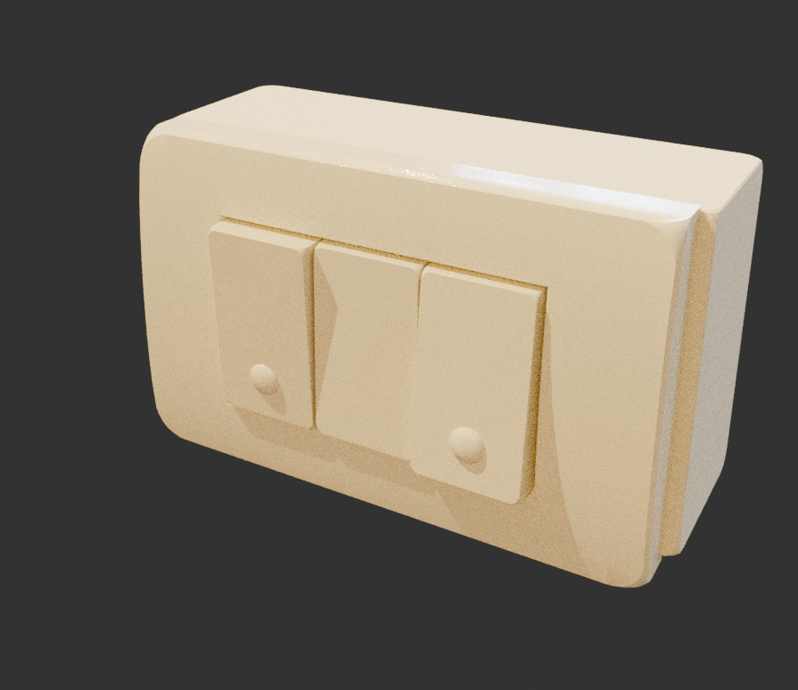
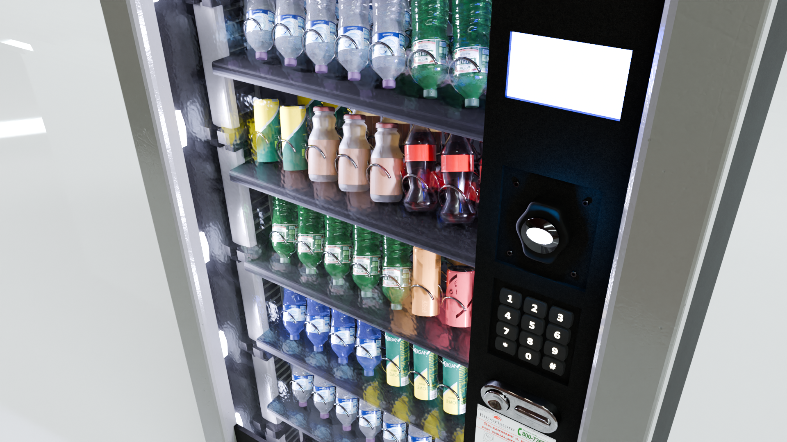
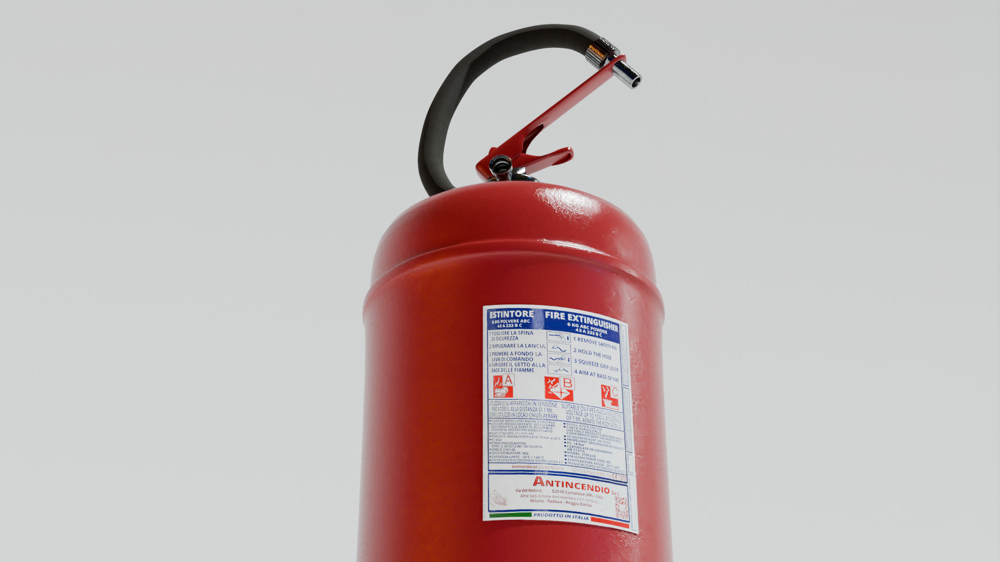

<h1>   UnivPM </h1> 
The results of my first 2-week Blender journey. Most of these models are heavily inspired by the props lying around my university and many textures were made this way. The purpose of this work is to implement a Exit8-like game in Unreal Engine, but I'll leave this for a future work, as it's not as straightforward as I expected.

### ➡️ Download available on my [cgtrader page](https://www.cgtrader.com/designers/valeriomorelli50).

# Hallway

    
    

    
    

    
    

# Sockets

    
    

# Electric frame

    
    

# Vending machine

    
    

# Table with phone

    
    

# Dumbbell

    
    

# Radiator

    
    

# Fire extinguisher

    
    

# Fire alarm

    
    

# Bin

    
    

